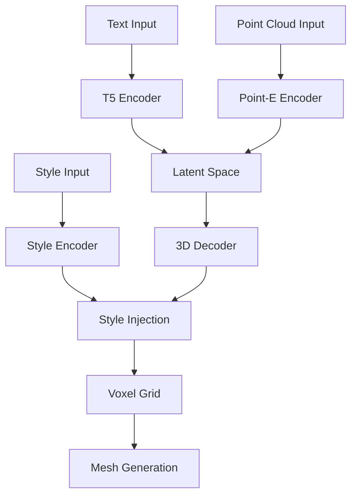

# 🎓 Ötüken3D Model Eğitimi

## İçindekiler
- [Genel Bakış](#genel-bakış)
- [Model Mimarisi](#model-mimarisi)
- [Transfer Learning](#transfer-learning)
- [Eğitim Pipeline'ı](#eğitim-pipelineı)
- [Veri Hazırlama](#veri-hazırlama)
- [Eğitim Süreci](#eğitim-süreci)
- [Monitoring](#monitoring)

## Genel Bakış

Ötüken3D modeli, Point-E ve T5 gibi pretrained modellerden transfer learning ile Türk sanatı ve motiflerine özel 3D model üretimi yapabilen bir modeldir. Model, metin açıklamalarından veya referans görsellerden yüksek kaliteli 3D modeller üretebilmektedir.

## Model Mimarisi



### Bileşenler

1. **Text Encoder**:
   - Pretrained T5 model
   - Türkçe dil desteği
   - Sanat terminolojisi için fine-tuning

2. **Point-E Encoder**:
   - OpenAI'nin Point-E modelinden transfer
   - Frozen weights
   - 3D geometri anlayışı

3. **3D Decoder**:
   - Voxel-based generation
   - Progressive growing
   - Multi-scale features

4. **Style Injection**:
   - AdaIN layers
   - Style mixing
   - Local-global control

## Transfer Learning

### Pretrained Modeller

1. **Point-E**:
```python
# Point-E encoder'ını yükle ve freeze et
encoder = torch.hub.load('openai/point-e', 'encoder')
for param in encoder.parameters():
    param.requires_grad = False
```

2. **T5**:
```python
# T5 modelini yükle
text_encoder = T5EncoderModel.from_pretrained("google/t5-v1_1-base")
```

### Fine-tuning Stratejisi

1. **Aşamalı Çözünürlük**:
```python
voxel_sizes = [32, 48, 64]  # Progressive growing
for size in voxel_sizes:
    model.set_voxel_size(size)
    train_epoch(model, dataloader)
```

2. **Layer Freezing**:
```python
# İlk aşamada sadece decoder'ı eğit
for param in model.text_encoder.parameters():
    param.requires_grad = False
for param in model.decoder.parameters():
    param.requires_grad = True
```

## Eğitim Pipeline'ı

### Yapılandırma

```yaml
model:
  text_encoder: "google/t5-v1_1-base"
  voxel_size: 64
  latent_dim: 512

training:
  batch_size: 32
  num_epochs: 100
  learning_rate: 1e-4
  weight_decay: 1e-5
```

### Kullanım

```python
# Model oluştur
model = Otuken3DModel(
    text_encoder_name="google/t5-v1_1-base",
    voxel_size=64,
    latent_dim=512
)

# Trainer oluştur
trainer = Otuken3DTrainer(
    model=model,
    train_loader=train_loader,
    val_loader=val_loader,
    learning_rate=1e-4
)

# Eğitimi başlat
trainer.train(
    num_epochs=100,
    save_every=5,
    early_stopping_patience=10
)
```

## Veri Hazırlama

### Veri Formatı

```python
batch = {
    'text': List[str],          # Metin açıklamaları
    'mesh': Meshes,             # Target 3D mesh
    'style_text': List[str],    # Opsiyonel stil açıklaması
    'points': torch.Tensor      # Nokta bulutu
}
```

### Augmentasyon

```python
augmentation_config = {
    'rotation_range': [-30, 30],
    'scale_range': [0.8, 1.2],
    'jitter_strength': 0.1
}
```

## Eğitim Süreci

### Loss Fonksiyonları

1. **Chamfer Distance**:
```python
chamfer_loss, _ = chamfer_distance(pred_points, target_points)
```

2. **Mesh Regularization**:
```python
edge_loss = mesh_edge_loss(pred_mesh)
laplacian_loss = mesh_laplacian_smoothing(pred_mesh)
```

### Optimizasyon

```python
optimizer = optim.AdamW(
    model.parameters(),
    lr=1e-4,
    weight_decay=1e-5
)

scheduler = optim.lr_scheduler.ReduceLROnPlateau(
    optimizer,
    mode='min',
    factor=0.5,
    patience=5
)
```

## Monitoring

### Metrikler

1. **Training Metrics**:
   - Loss değerleri
   - Gradient normları
   - Learning rate

2. **Validation Metrics**:
   - Chamfer distance
   - IoU
   - FID score

### Visualization

```python
# Weights & Biases logging
wandb.log({
    "loss": loss.item(),
    "learning_rate": optimizer.param_groups[0]['lr'],
    "generated_mesh": wandb.Object3D(mesh_file)
})
```

### Best Practices

1. **Gradient Clipping**:
```python
torch.nn.utils.clip_grad_norm_(model.parameters(), max_norm=1.0)
```

2. **Mixed Precision**:
```python
scaler = torch.cuda.amp.GradScaler()
with torch.cuda.amp.autocast():
    loss = model(batch)
```

3. **Memory Optimization**:
```python
# Gradient checkpointing
model.gradient_checkpointing_enable()
``` 