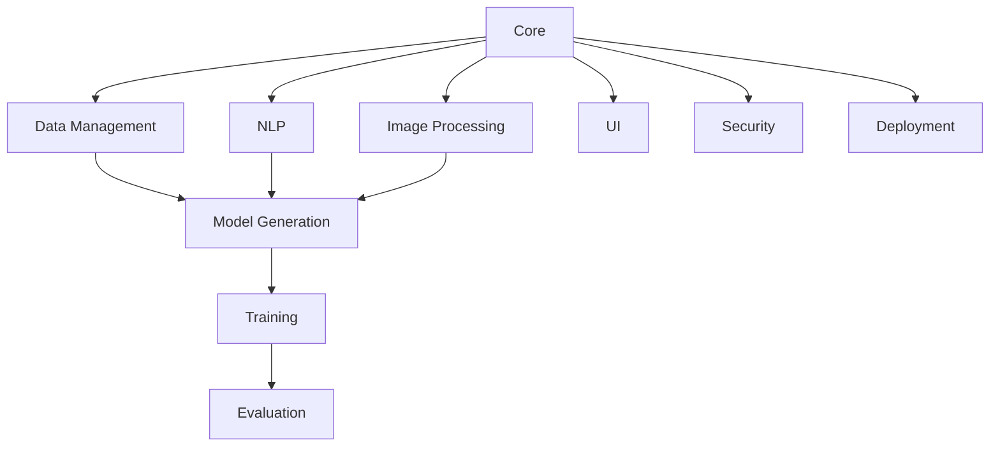

# Modüller

Bu dizin, Ötüken3D projesinin ana modüllerini içerir.

## 📦 Modül Yapısı

```
modules/
├── core/              # Temel işlevler ve sınıflar
├── data_management/   # Veri yönetimi ve işleme
├── nlp/              # Doğal dil işleme
├── image_processing/ # Görüntü işleme
├── model_generation/ # Model üretimi
├── training/         # Model eğitimi
├── evaluation/       # Model değerlendirme
├── ui/              # Kullanıcı arayüzü
├── security/        # Güvenlik kontrolleri
└── deployment/      # Dağıtım araçları
```

## 🔍 Modül Detayları

### Core
- Temel veri yapıları
- Ortak yardımcı fonksiyonlar
- Sistem yapılandırması
- Hata yönetimi

### Data Management
- Veri seti yükleme ve önişleme
- Veri dönüşümleri
- Veri doğrulama
- Veri augmentasyonu

### NLP
- Metin analizi
- Prompt işleme
- Dil modeli entegrasyonu
- Türkçe dil desteği

### Image Processing
- Görüntü önişleme
- Özellik çıkarma
- Görüntü segmentasyonu
- Doku analizi

### Model Generation
- 3D model üretimi
- Mesh işleme
- Doku haritalama
- Model optimizasyonu

### Training
- Model eğitim döngüsü
- Kayıp fonksiyonları
- Optimizasyon
- Checkpoint yönetimi

### Evaluation
- Model performans ölçümü
- Kalite değerlendirme
- Benchmark testleri
- Hata analizi

### UI
- Web arayüzü
- Model görselleştirme
- Kullanıcı etkileşimi
- Tema yönetimi

### Security
- Girdi doğrulama
- API güvenliği
- Model koruma
- Erişim kontrolü

### Deployment
- Model paketleme
- Dağıtım scriptleri
- Ölçeklendirme
- Performans izleme

## 💡 Kullanım

Her modül kendi README.md dosyasına sahiptir. Detaylı kullanım bilgileri için ilgili modülün dokümantasyonuna bakın.

## 🔄 Modül Bağımlılıkları



## 📝 Geliştirme Kuralları

1. Her modül kendi dizininde `__init__.py` içermeli
2. Tüm public API'ler dokümante edilmeli
3. Birim testleri yazılmalı
4. Tip bilgileri (type hints) kullanılmalı
5. Docstring'ler Google formatında olmalı

## 🧪 Test

Her modül için test dosyaları `tests/` dizininde bulunur:

```bash
# Tüm modül testlerini çalıştır
pytest tests/modules/

# Belirli bir modülün testlerini çalıştır
pytest tests/modules/core/
``` 